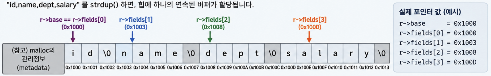

# Challenge 12 — free() 대상이 힙이 아님 (심화: CSV 필드 내부 포인터)
## 문제 확인

코드를 눈으로 봤을 때는 오류가 바로 보이지 않았다.  
우선 GDB로 실행해봤다.

```text
4 fields: [id] [name] [dept] [salary]
free(): invalid pointer
```

`free(): invalid pointer`가 발생했다.

이는 `free()`할 수 없는 포인터를 넘겼다는 뜻이다.

`row_free()`에서는 단순히 반복문을 돌며 `fields[i]`를 하나씩 해제하고 있었기 때문에, 각 `fields`가 실제로 어떤 주소를 가리키는지 확인해보기로 했다.

## GDB로 주소 확인

```gdb
(gdb) p/x r->base
$7 = 0xaaaaaaac12a0

(gdb) p/x r->fields[0]
$8 = 0xaaaaaaac12a0

(gdb) p/x r->fields[1]
$9 = 0xaaaaaaac12a3

(gdb) p/x r->fields[2]
$10 = 0xaaaaaaac12a8

(gdb) p/x r->fields[3]
$11 = 0xaaaaaaac12ad
```

처음에는 문자열 길이에 맞게 주소가 증가하고 있어서 정상처럼 보였다.

하지만 `base`와 비교해보니 중요한 점이 보였다.

```text
base      = 0x...12a0

fields[0] = 0x...12a0
fields[1] = 0x...12a3
fields[2] = 0x...12a8
fields[3] = 0x...12ad
```

`fields[0]`만 `base`와 같은 주소이고, 나머지는 모두 `base`보다 뒤쪽의 주소를 가리키고 있었다.


## `row_free()`를 한 번씩 실행해보기

```gdb
(gdb) break row_free
(gdb) next

(gdb) p i
$12 = 0

(gdb) p/x r->fields[0]
$13 = 0xaaaaaaac12a0

(gdb) p/x r->base
$14 = 0xaaaaaaac12a0
```

첫 번째 반복에서는: **fields[0] == base**였다.

따라서 **free(r->fields[0]);** 는 사실상 **free(r->base);**
와 같다.

```gdb
(gdb) p i
$16 = 1

(gdb) p/x r->fields[1]
$17 = 0xaaaaaaac12a3

(gdb) p/x r->base
$18 = 0xaaaaaaac12a0
```

이번에는 주소가 다르다.

```text
base      = 0x...12a0
fields[1] = 0x...12a3
```

그리고 실행하면:

```text
free(): invalid pointer

Program received signal SIGABRT, Aborted.
```

여기서 문제가 발생했다.

## 원인

실제 메모리 할당은 다음 코드에서 **한 번만** 발생한다.

```c
r->base = strdup(csv);
```

`strtok()`은 각 문자열을 새롭게 할당하는 것이 아니다.

하나의 `base` 버퍼 내부에서 쉼표를 `\0`으로 변경하고, 각 문자열이 시작되는 위치를 `fields[]`에 저장한다.

```text
base
 ↓
[id\0name\0dept\0salary\0]
 ↑   ↑      ↑     ↑
f[0] f[1]   f[2]  f[3]
```

따라서 역할을 구분하면 다음과 같다.

```text
base       → owning pointer
fields[i]  → non-owning / borrowed pointer
```

`base`가 실제 메모리를 소유하고 있고, `fields[]`는 그 메모리 내부를 가리킬 뿐이다.

따라서 `fields[1]`처럼 메모리 중간을 가리키는 포인터를 `free()`할 수 없다.

## 첫 번째 수정

처음에는 다음처럼 수정했다.

```c
static void row_free(Row *r) {
    free(r->fields[0]);
    r->n = 0;
}
```

결과:

```text
4 fields: [id] [name] [dept] [salary]
done
[Inferior 1 exited normally]
```

현재 입력에서는 정상 동작한다.

하지만 이것이 가장 올바른 코드는 아니다.

`fields[0]`을 해제할 수 있었던 것은 **현재 우연히 `fields[0] == base`였기 때문**이다.


## 최종 수정

메모리를 실제로 생성한 코드는:

```c
r->base = strdup(csv);
```

이다.

따라서 소유자인 `base`를 직접 해제하는 것이 더 정확하다.

```c
static void row_free(Row *r) {
    free(r->base);
    r->base = NULL;
    r->n = 0;
}
```

예를 들어 입력이 다음과 같다면:

```c
parse_row(&r, ",name,dept");
```

`strtok()`은 앞의 구분자를 건너뛸 수 있기 때문에 `fields[0]`이 반드시 `base`와 같다는 보장이 없다.

따라서 메모리 해제는 `fields[0]`이 아니라 **실제로 할당받은 `base`를 기준으로 해야 한다.**

## 정리

이 문제에서 가장 중요했던 점은 **포인터의 개수와 메모리 할당 횟수는 다르다**는 것이다.

```text
strdup() → 메모리 1번 할당
fields[] → 같은 메모리 내부를 가리키는 여러 포인터
free()   → base를 기준으로 1번만 수행
```

`fields[]`가 여러 개 존재한다고 각각 `free()`해야 하는 것이 아니다.  
**누가 메모리를 할당받아 소유하고 있는지를 기준으로 해제해야 한다.**